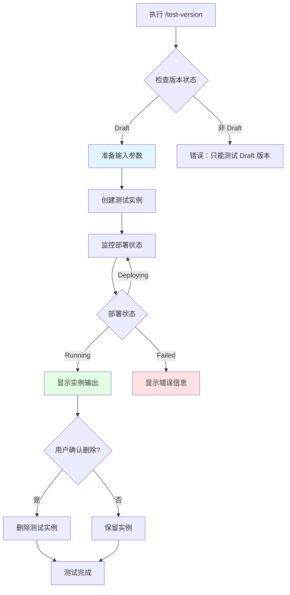

# /test-version 命令

测试 AppMarket Draft 版本，创建测试实例并验证部署功能。

---

## 用法

```bash
/test-version <appID> <version> [options]
```

## 参数

| 参数 | 必需 | 说明 | 示例 |
|-----|------|------|------|
| `appID` | 是 | 应用 ID | `app-xxxxxxxxxxxx` |
| `version` | 是 | 版本号（必须是 Draft 状态） | `1.0.0`, `1.0.0-draft` |
| `--region` | 否 | 部署区域 | `ap-northeast-1`（默认） |
| `--inputs` | 否 | 输入参数 JSON 文件路径 | `test-inputs.json` |
| `--wait` | 否 | 等待实例部署完成 | 默认启用 |
| `--cleanup` | 否 | 测试完成后自动删除实例 | 默认禁用 |

---

## 快速开始

### 1. 基本测试

使用默认参数测试 Draft 版本：

```bash
/test-version app-xxxxxxxxxxxx 1.0.0
```

命令会自动：
1. 检查版本是否为 Draft 状态
2. 使用 InputSchema 中的默认值创建测试实例
3. 监控部署进度
4. 显示实例输出
5. 等待用户确认后删除实例

> 这里的“创建测试实例”就是内部调用 `POST /v1/app-instances/` 创建 AppInstance。

### 2. 自定义参数测试

使用自定义输入参数：

```bash
# 创建输入参数文件
cat > test-inputs.json <<EOF
{
  "instance_name": "test-mysql",
  "instance_type": "ecs.c1.c2m4",
  "system_disk_size": 50,
  "mysql_username": "admin",
  "mysql_password": "<YourPassword>",
  "mysql_db_name": "testdb"
}
EOF

# 执行测试
/test-version app-xxxxxxxxxxxx 1.0.0 --inputs test-inputs.json
```

### 3. 自动清理模式

测试完成后自动删除实例：

```bash
/test-version app-xxxxxxxxxxxx 1.0.0 --cleanup
```

---

## 工作流程



---

## 输出示例

### 成功场景

```
🧪 测试 Draft 版本
━━━━━━━━━━━━━━━━━━━━━━━━━━━━━━━━━━━━━━━━

应用 ID: app-xxxxxxxxxxxx
版本号: 1.0.0
状态: Draft ✓

📝 准备输入参数
━━━━━━━━━━━━━━━━━━━━━━━━━━━━━━━━━━━━━━━━

使用默认值:
  instance_name: my-mysql
  instance_type: ecs.c1.c2m4
  system_disk_size: 50
  mysql_username: admin
  mysql_password: **********
  mysql_db_name: testdb

🚀 创建测试实例
━━━━━━━━━━━━━━━━━━━━━━━━━━━━━━━━━━━━━━━━

实例 ID: appi-xxxxxxxxxxxx
区域: ap-northeast-1
状态: Deploying

⏳ 部署进度
━━━━━━━━━━━━━━━━━━━━━━━━━━━━━━━━━━━━━━━━

[00:30] Initializing...
[01:15] Creating compute instance...
[02:30] Configuring network...
[03:45] Running initialization scripts...
[04:20] Running ✓

✓ 实例部署成功！
━━━━━━━━━━━━━━━━━━━━━━━━━━━━━━━━━━━━━━━━

📊 实例输出
━━━━━━━━━━━━━━━━━━━━━━━━━━━━━━━━━━━━━━━━

mysql_endpoint     = "10.0.1.100:3306"
mysql_username     = "admin"
mysql_password     = "<YourPassword>" (sensitive)
instance_id        = "i-xxxxxxxxxxxx"
instance_ip        = "10.0.1.100"

🔍 验证建议
━━━━━━━━━━━━━━━━━━━━━━━━━━━━━━━━━━━━━━━━

1. 连接测试:
   mysql -h 10.0.1.100 -u admin -p'<YourPassword>'

2. 健康检查:
   mysqladmin ping -h 10.0.1.100 -u admin -p'<YourPassword>'

3. 查看日志:
   ssh ubuntu@10.0.1.100 "tail -f /var/log/mysql-init.log"

🗑️  清理资源
━━━━━━━━━━━━━━━━━━━━━━━━━━━━━━━━━━━━━━━━

是否删除测试实例？[Y/n]: Y

删除中...
✓ 实例已删除

测试完成！
```

### 失败场景

```
🧪 测试 Draft 版本
━━━━━━━━━━━━━━━━━━━━━━━━━━━━━━━━━━━━━━━━

应用 ID: app-xxxxxxxxxxxx
版本号: 1.0.0
状态: Draft ✓

🚀 创建测试实例
━━━━━━━━━━━━━━━━━━━━━━━━━━━━━━━━━━━━━━━━

实例 ID: appi-xxxxxxxxxxxx
区域: ap-northeast-1
状态: Deploying

⏳ 部署进度
━━━━━━━━━━━━━━━━━━━━━━━━━━━━━━━━━━━━━━━━

[00:30] Initializing...
[01:15] Creating compute instance...
[01:45] Failed ✗

✗ 实例部署失败
━━━━━━━━━━━━━━━━━━━━━━━━━━━━━━━━━━━━━━━━

错误信息:
  Instance type 'ecs.c1.c2m4' is not available in region 'ap-northeast-1'

📋 排查建议
━━━━━━━━━━━━━━━━━━━━━━━━━━━━━━━━━━━━━━━━

1. 检查实例规格是否在指定区域可用
2. 查看完整日志:
   curl https://ap-northeast-1-ecs.qiniuapi.com/v1/app-instances/appi-xxx
3. 查看 Terraform State:
   通过 RFS API 查询 Stack 状态

🗑️  清理资源
━━━━━━━━━━━━━━━━━━━━━━━━━━━━━━━━━━━━━━━━

是否删除失败的实例？[Y/n]: Y
✓ 实例已删除
```

---

## API 调用示例

命令内部使用以下 API 调用：

### 1. 检查版本状态

```bash
GET /v1/apps/{appID}/versions/{version}
```

**响应**：
```json
{
  "appID": "app-xxxxxxxxxxxx",
  "version": "1.0.0",
  "status": "Draft",
  "deployMeta": {
    "inputSchema": {...},
    "terraformModule": {...},
    "inputPresets": [...]
  }
}
```

### 2. 创建测试实例

> **注意**：实例 API 必须使用 region 前缀域名 `{regionID}-ecs.qiniuapi.com`，regionID 通过 Host header 提取。

```bash
POST https://{regionID}-ecs.qiniuapi.com/v1/app-instances/
```

**请求体**：
```json
{
  "appID": "app-xxxxxxxxxxxx",
  "appVersion": "1.0.0",
  "inputPresetName": "starter",
  "clientToken": "unique-idempotency-token-uuid",
  "inputs": {
    "mysql_password": "<YourPassword>"
  }
}
```

> **inputs 说明**：使用 `inputPresetName` 时，`inputs` 中**只需传 preset 未覆盖的 required 字段**（通常是 `writeOnly`/`sensitive` 字段如密码、API Key）。传入 preset 已有的字段会导致冲突。

**响应**：
```json
{
  "appInstanceID": "appi-xxxxxxxxxxxx"
}
```

### 3. 查询实例状态

```bash
GET https://{regionID}-ecs.qiniuapi.com/v1/app-instances/{appInstanceID}
```

**响应**：
```json
{
  "appInstanceID": "appi-xxxxxxxxxxxx",
  "status": "Running",
  "outputs": {
    "mysql_endpoint": "10.0.1.100:3306",
    "mysql_username": "admin",
    "instance_id": "i-xxxxxxxxxxxx",
    "instance_ip": "10.0.1.100"
  }
}
```

### 4. 删除实例

```bash
DELETE https://{regionID}-ecs.qiniuapi.com/v1/app-instances/{appInstanceID}
```

---

## 错误处理

### 版本不是 Draft 状态

```
✗ 错误: 版本 1.0.0 状态为 Published，只能测试 Draft 版本

建议:
  1. 创建新的 Draft 版本进行测试
  2. 或使用现有的 Draft 版本
```

### 必需参数缺失

```
✗ 错误: InputSchema 中有必需参数但未提供默认值

缺失参数:
  - mysql_password (type: string, required: true)

解决方法:
  1. 在 InputSchema 中为必需参数添加默认值
  2. 或使用 --inputs 参数提供输入文件
```

### 区域不可用

```
✗ 错误: 指定的区域 'cn-west-1' 不可用

可用区域:
  - ap-northeast-1 (亚太东北)
  - ap-southeast-1 (亚太东南 1)
  - ap-southeast-2 (亚太东南 2)
  - cn-changshan-1 (常山)
  - cn-hongkong-1 (香港)
  - cn-shaoxing-1 (绍兴)
```

### 配额不足

```
✗ 错误: 配额不足

当前配额:
  CPU: 8 核 (已用: 6 核)
  内存: 16 GB (已用: 12 GB)
  磁盘: 500 GB (已用: 450 GB)

请求配额:
  CPU: 4 核
  内存: 8 GB
  磁盘: 100 GB

建议:
  1. 删除不使用的实例释放配额
  2. 联系技术支持申请配额提升
```

---

## 最佳实践

### 1. 测试不同规格

```bash
# 测试入门规格
cat > test-basic.json <<EOF
{
  "instance_type": "ecs.t1.c1m2",
  "system_disk_size": 20
}
EOF
/test-version app-xxx 1.0.0 --inputs test-basic.json --cleanup

# 测试标准规格
cat > test-standard.json <<EOF
{
  "instance_type": "ecs.c1.c2m4",
  "system_disk_size": 50
}
EOF
/test-version app-xxx 1.0.0 --inputs test-standard.json --cleanup

# 测试高配规格
cat > test-pro.json <<EOF
{
  "instance_type": "ecs.c1.c8m16",
  "system_disk_size": 200
}
EOF
/test-version app-xxx 1.0.0 --inputs test-pro.json --cleanup
```

### 2. 测试不同区域

```bash
# 亚太东北
/test-version app-xxx 1.0.0 --region ap-northeast-1 --cleanup

# 常山
/test-version app-xxx 1.0.0 --region cn-changshan-1 --cleanup

# 香港
/test-version app-xxx 1.0.0 --region cn-hongkong-1 --cleanup
```

### 3. 保留实例进行手动验证

```bash
# 不自动删除，手动验证功能
/test-version app-xxx 1.0.0

# 验证后手动删除（注意使用 region 前缀域名）
curl -X DELETE "https://ap-northeast-1-ecs.qiniuapi.com/v1/app-instances/appi-xxx" \
  -H "Authorization: Qiniu $ACCESS_KEY:$SIGNATURE"
```

---

## 相关命令

| 命令 | 说明 |
|-----|------|
| `/create-version` | 创建新版本 |
| `/publish-version` | 发布版本 |
| 本地测试脚本 | `scripts/test-module.sh` |

---

## 相关资源

- [模块测试指南](../module-testing.md)
- [本地测试脚本](../scripts/test-module.sh)
- [AppMarket API 文档](../README.md#api-端点)
