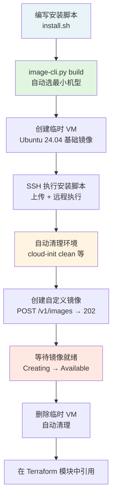

# 应用镜像制作指南

本指南介绍如何为 AppMarket 应用制作自定义系统镜像。LAS 的自定义镜像是云主机系统盘快照，通过「创建云主机 → 安装配置软件 → 创建自定义镜像」的方式制作。

---

## 目录

- [1. 镜像制作概述](#1-镜像制作概述)
- [2. 一键制作镜像（推荐）](#2-一键制作镜像推荐)
- [3. 编写安装脚本](#3-编写安装脚本)
- [5. 服务启动策略与初始化脚本](#5-服务启动策略与初始化脚本)
- [6. 在 Terraform 模块中引用镜像](#6-在-terraform-模块中引用镜像)
- [7. 最佳实践](#7-最佳实践)
- [8. 镜像管理常用命令](#8-镜像管理常用命令)

---

## 1. 镜像制作概述

### 1.1 什么是自定义镜像

LAS 自定义镜像是从**运行中的云主机实例**创建的系统盘快照。它不是 Docker 容器镜像，而是完整的操作系统磁盘镜像，包含操作系统、预装软件、配置文件等。

### 1.2 为什么需要自定义镜像

- **缩短部署时间**：预装软件避免每次实例启动时下载安装
- **保证一致性**：所有用户部署的实例使用相同的软件版本和基础配置
- **安全加固**：预配置安全策略、删除不必要的包

### 1.3 镜像与 Terraform 模块的关系

```
官方 OS 镜像 → 创建云主机 → 安装软件 → 创建自定义镜像
                                              ↓
                                    Terraform 模块引用镜像 ID
                                              ↓
                                    AppMarket 版本部署
```

- **官方镜像**：Ubuntu 24.04 LTS 等由平台提供的基础系统镜像
- **自定义镜像**：在官方镜像基础上预装应用软件后制作的镜像（类型为 `Custom`）
- **Terraform 模块**：通过 `data "qiniu_compute_images"` 查询镜像或直接引用镜像 ID

### 1.4 完整流程



---

## 2. 一键制作镜像（推荐）

使用 `scripts/vm-cli.py / scripts/image-cli.py` 自动完成全流程：创建 VM → 等待就绪 → SSH 执行安装脚本 → 清理环境 → 创建镜像 → 等待就绪 → 删除 VM。

> **重要**：如果应用有官方 standalone release，安装脚本应使用对应的官方 release 包。
> 制作镜像时只完成安装，不要实际启动服务，避免留下运行态临时文件；应用依赖、运行时和配置都应在镜像里准备好，并在干净 VM 上复现安装结果后再 snapshot。

### 2.1 前置条件

- Python 3.8+（无第三方依赖）
- `sshpass`（密码方式 SSH 连接，`apt install sshpass` / `brew install sshpass`）
- 环境变量 `QINIU_ACCESS_KEY` 和 `QINIU_SECRET_KEY`

### 2.2 基本用法

```bash
export QINIU_ACCESS_KEY="your-ak"
export QINIU_SECRET_KEY="your-sk"

# 一键制作镜像（自动选择最小可用机型）
python3 scripts/image-cli.py build \
  --install-script path/to/install.sh \
  --image-name <app>-v1.0.0 \
  --image-desc "Ubuntu 24.04 + <app> v1.0.0"
```

脚本会自动：
1. 查询最小可用机型（非 GPU，按 CPU + 内存排序）
2. 查询 Ubuntu 24.04 官方基础镜像
3. 创建临时 VM 并等待启动
4. 通过 SSH 上传并执行安装脚本
5. 执行标准清理（apt clean、cloud-init clean、删除 SSH 密钥等）
6. 创建自定义镜像并等待状态变为 `Available`
7. 删除临时 VM

### 2.3 机型选择

制作镜像时应使用**满足安装需求的最小机型**，避免镜像绑定过高的资源需求。

```bash
# 查看当前区域可用机型（按 CPU + 内存升序排列，不含 GPU）
python3 scripts/vm-cli.py list-types --region ap-northeast-1

# 按规格族过滤
python3 scripts/vm-cli.py list-types --family t1
```

不指定 `--instance-type` 时，`build` 命令会自动选择最小的可用机型。如需手动指定：

```bash
python3 scripts/image-cli.py build \
  --install-script my-install.sh \
  --image-name my-app-v1.0 \
  --instance-type ecs.t1.c2m4 \
  --disk-size 60
```

### 2.4 调试模式

使用 `--keep-vm` 保留 VM 不删除，方便 SSH 登录排查问题：

```bash
python3 scripts/image-cli.py build \
  --install-script my-install.sh \
  --image-name test --keep-vm
```

脚本会输出 VM 的 IP、密码和 SSH 命令，排查完成后手动删除：

```bash
python3 scripts/vm-cli.py delete-vm --instance-id i-xxxxx
```

### 2.5 常见报错与绕过

#### EBSNotEnabled [403]

```
Error: EBSNotEnabled [403]
```

账号未开通 EBS（弹性块存储）功能，无法使用 `cloud.ssd` 磁盘类型（默认值）。解决方法：改用本地 SSD：

```bash
python3 scripts/image-cli.py build \
  --install-script path/to/install.sh \
  --image-name MyApp-v1.0.0 \
  --disk-type local.ssd   # 加上这一行
```

#### build 命令 SSH 连接超时

```
Waiting for SSH...
Timeout waiting for SSH connection
```

`image-cli.py build` 内部等待 SSH 就绪有 120 秒限制，某些区域/机型启动较慢时会触发。绕过方式：把三步分开执行：

```bash
# 第 1 步：手动创建 VM，等待真正就绪
python3 scripts/vm-cli.py create-vm \
  --instance-type ecs.t1.c2m4 \
  --disk-type local.ssd \
  --image-name MyApp-v1.0.0

# 记录输出的 instance_id、ip、password

# 第 2 步：在已运行的 VM 上跑安装脚本
python3 scripts/image-cli.py run-script \
  --instance-id i-xxxxxxxx \
  --host <ip> \
  --password <password> \
  --script path/to/install.sh

# 第 3 步：对 VM 打快照，制作镜像
python3 scripts/image-cli.py create-image \
  --instance-id i-xxxxxxxx \
  --image-name MyApp-v1.0.0 \
  --image-desc "Ubuntu 24.04 + MyApp 1.0.0"

# 完成后手动删除 VM
python3 scripts/vm-cli.py delete-vm --instance-id i-xxxxxxxx
```

### 2.6 排查残留 VM

如果脚本被强制终止导致 VM 未清理：

```bash
# 列出当前区域所有 VM
python3 scripts/vm-cli.py list-vms --region ap-northeast-1

# 删除残留 VM
python3 scripts/vm-cli.py delete-vm --instance-id i-xxxxx
```

### 2.7 完整参数

| 参数 | 默认值 | 说明 |
|------|--------|------|
| `--install-script` | （必需） | 安装脚本路径，将通过 SCP 上传到 VM 以 root 执行 |
| `--image-name` | （必需） | 镜像名称 |
| `--image-desc` | 自动生成 | 镜像描述 |
| `--region` | `ap-northeast-1` | 区域，自定义镜像绑定创建时的区域 |
| `--instance-type` | 自动选最小 | VM 规格，可通过 `list-types` 查看 |
| `--disk-type` | `cloud.ssd` | 磁盘类型（`local.ssd` 或 `cloud.ssd`） |
| `--disk-size` | `20` | 系统盘大小 GB，范围 20–500（LAS 平台限制），镜像大小 = 实际使用量 |
| `--bandwidth` | `100` | 峰值带宽 Mbps，可选 50/100/200 |
| `--base-image` | 自动查询 Ubuntu 24.04 | 基础镜像 ID |
| `--password` | 随机生成 | VM 密码 |
| `--ssh-user` | `root` | SSH 用户名 |
| `--keep-vm` | `false` | 完成后保留 VM 不删除 |

---

## 3. 编写安装脚本

安装脚本是在 VM 上以 root 身份执行的 bash 脚本，负责安装和配置应用软件。`image-cli.py` / `vm-cli.py` 会通过 SCP 上传脚本到 VM 并执行。

### 3.1 脚本模板

参考 `assets/setup-image.sh` 模板，基本结构：

```bash
#!/bin/bash
set -euo pipefail

log() {
    echo "[$(date +'%Y-%m-%d %H:%M:%S')] $*"
}

# 阶段 1: 安装依赖
log "安装依赖..."
apt-get update
apt-get install -y --no-install-recommends curl wget ca-certificates

# 阶段 2: 安装应用软件（根据你的应用修改）
log "安装应用..."
# ...

# 阶段 3: 验证安装
log "验证..."
# ...

log "安装完成"
```

### 3.1.1 非交互式原则（必须遵守）

安装脚本由 `image-cli.py` 通过 SSH 执行，**stdin 已重定向到 `/dev/null`**。任何等待用户输入的命令都会立即收到 EOF 并可能导致脚本失败或行为异常。

**必须在脚本顶部设置以下环境变量：**

```bash
export DEBIAN_FRONTEND=noninteractive   # 禁止 apt/dpkg 弹出 debconf 配置界面（如 tzdata 时区选择）
export NEEDRESTART_MODE=a               # Ubuntu 22.04+ 自动重启受影响的服务，跳过交互提示
export UCF_FORCE_CONFFOLD=1             # apt 升级时配置文件冲突自动保留旧版本
```

**第三方安装脚本（`curl | bash` 类）的处理方式：**

| 情况 | 处理方式 |
|------|---------|
| 支持 `--yes` / `--non-interactive` / `--skip-setup` 等标志 | 在调用命令中显式传入 |
| 支持环境变量控制 | 查阅文档，提前 `export` 相应变量 |
| 不支持任何静默模式 | 不应使用此安装脚本；需找替代安装方式或手动分解安装步骤 |

**验证方法**：可以用 `bash -n script.sh` 做本地语法检查。功能验证必须在 VM 上进行——用 `--keep-vm` 保留构建 VM，或用 `run-script` 在已有 VM 上重跑脚本，不要在本地直接执行安装脚本（会污染本地环境）。

### 3.2 示例：应用安装脚本

参考 `assets/setup-image.sh` 模板，以下是一个典型的安装脚本结构：

```bash
#!/bin/bash
set -euo pipefail

# 安装运行时依赖（以 Node.js 为例）
curl -fsSL https://deb.nodesource.com/setup_22.x | bash -
apt install -y nodejs

# 安装应用及其依赖
git config --global url."https://github.com/".insteadOf ssh://git@github.com/
npm install -g --loglevel info myapp@1.0.0
rm -fv /root/.gitconfig

# 创建运行用户
useradd -m -s /bin/bash myapp
usermod -aG sudo myapp
loginctl enable-linger myapp

# 配置用户环境
sudo -u myapp bash -c 'mkdir -p ~/.myapp/data'
chmod 700 /home/myapp/.myapp
```

### 3.3 必须保留的软件

以下软件是 LAS 云主机正常运行的基础，**不能删除或禁用**：

| 软件 | 说明 |
|------|------|
| cloud-init | LAS 依赖它在实例启动时注入 user_data 初始化脚本 |
| systemd | 系统服务管理 |
| curl | HTTP 客户端，健康检查等场景需要 |
| ca-certificates | SSL 证书，HTTPS 通信需要 |
| openssh-server | SSH 远程管理 |

### 3.4 安装应用软件示例

**数据库类**：

```bash
# MySQL 8.0
sudo apt update
sudo apt install -y mysql-server mysql-client
sudo systemctl enable mysql

# PostgreSQL 16
sudo apt install -y postgresql-16 postgresql-client-16
sudo systemctl enable postgresql

# Redis 7
sudo apt install -y redis-server
sudo systemctl enable redis-server
```

**Web 服务器类**：

```bash
# Nginx
sudo apt install -y nginx
sudo systemctl enable nginx
```

**运行时类**：

```bash
# Node.js 22
curl -fsSL https://deb.nodesource.com/setup_22.x | sudo -E bash -
sudo apt install -y nodejs
```

### 3.5 创建应用用户（可选）

如果应用需要独立用户：

```bash
useradd -m -s /bin/bash appuser
usermod -aG sudo appuser
mkdir -p /home/appuser/.config
chmod 700 /home/appuser/.config
chown -R appuser:appuser /home/appuser
```

> **注意**：安装脚本中不需要包含清理步骤（apt clean、cloud-init clean 等），`image-cli.py` / `vm-cli.py` 会在脚本执行完成后自动执行标准清理。

---

## 5. 服务启动策略与初始化脚本

自定义镜像负责预装软件，实例启动时的个性化配置（API Key、密码等）通过 Terraform `user_data` 注入，服务如何启动取决于镜像制作时选定的策略。

### 5.1 服务自启动策略（必须与用户确认）

**在编写安装脚本之前，必须先与用户明确以下决策，因为它直接决定安装脚本和 user_data 的写法：**

| 策略 | 镜像里 | user_data 里 | 适用场景 |
|------|--------|--------------|---------|
| **A：user_data 中 enable + start**（推荐） | 只安装，**不 enable** | 写完配置后 `systemctl enable --now` | 服务依赖 user_data 注入的配置（API Key、密码等）才能正常启动 |
| **B：镜像中 enable，user_data 只注入配置** | `systemctl enable` | 写完配置后 `systemctl restart` | 服务有合理的默认配置，缺少配置时能优雅等待或报错而不崩溃循环 |

> **策略 A 的关键风险**：直接从镜像手动建 VM（不经过 AppMarket/user_data）时，服务**不会自启动**——这是预期行为。用户若需手动启动，需先手写配置文件，再 `systemctl enable --now <service>`。
>
> **策略 B 的关键风险**：镜像中 enable 后，实例首次启动时服务在 user_data 执行前就已运行，此时配置文件尚未写入，服务会以空/默认配置启动（或失败重启）。仅当服务在无配置时能优雅处理（如等待配置文件出现、或仅以降级模式运行）时才适合。

**确认原则**：询问用户——"服务是否依赖 user_data 注入的参数才能正常运行？" 
- **是** → 选策略 A，安装脚本中**不加** `systemctl enable`
- **否（服务有默认配置，可独立启动）** → 询问是否希望镜像中启用自启动，选策略 B

确认后，在安装脚本末尾按下表执行：

| 策略 | 安装脚本末尾 | user_data 末尾 |
|------|-------------|----------------|
| A | `systemctl daemon-reload`（不 enable） | `systemctl enable --now <service>` |
| B | `systemctl daemon-reload && systemctl enable <service>` | `systemctl restart <service>` |

**策略 A 的手动部署说明**（应写入应用文档或 README，供直接建 VM 的用户参考）：

```bash
# 直接从镜像建 VM 后，手动配置并启动服务
cat > /path/to/app.env <<EOF
API_KEY=your-key
# ... 其他必填配置
EOF
chmod 600 /path/to/app.env

systemctl enable --now <service-name>
```


### 5.2 脚本规范

| 规范 | 说明 |
|------|------|
| `set -e` | 遇错退出，避免错误被忽略 |
| 日志记录 | 关键步骤写入 `/var/log/appmarket/*.log`，便于排查 |
| 超时等待 | 服务启动等待设置合理超时（如 60 秒） |
| 幂等性 | 使用 `IF NOT EXISTS` 等，支持重复执行 |
| 敏感信息 | 密码等敏感信息**不要写入日志** |
| 路径 | 脚本放置在 `/usr/local/bin/` 或模块的 `scripts/` 目录 |

---

## 6. 在 Terraform 模块中引用镜像

### 6.1 通过 data source 动态查询（推荐）

使用 `qiniu_compute_images` data source 按条件查询镜像：

```hcl
# 查询官方 Ubuntu 24.04 镜像
data "qiniu_compute_images" "official" {
  type  = "Official"
  state = "Available"
}

locals {
  ubuntu_image_id = one([
    for item in data.qiniu_compute_images.official.items : item
    if item.os_distribution == "Ubuntu" && item.os_version == "24.04 LTS"
  ]).id
}

# 查询自定义镜像
data "qiniu_compute_images" "custom" {
  type  = "Custom"
  state = "Available"
}

locals {
  mysql_image_id = one([
    for item in data.qiniu_compute_images.custom.items : item
    if item.name == "ubuntu-24.04-mysql-8.0"
  ]).id
}
```

### 6.2 多区域部署：命名前缀 + data source 动态查找（推荐）

自定义镜像**绑定制作时的区域**，不同区域的镜像 ID 不同。推荐使用「名称前缀 + 区域后缀」的命名约定，配合 data source 动态查找，避免硬编码 image ID：

**命名约定**：`<AppName>-v<Version>-<region-suffix>`，区域后缀用于区分，前缀保持一致。

```bash
# 在 cn-hongkong-1 制作
python3 scripts/image-cli.py build \
  --install-script path/to/install.sh \
  --image-name MyApp-v1.0.0-hkg \
  --region cn-hongkong-1

# 在 ap-northeast-1 制作（相同安装脚本）
python3 scripts/image-cli.py build \
  --install-script path/to/install.sh \
  --image-name MyApp-v1.0.0-tyo \
  --region ap-northeast-1
```

**Terraform 模块：用名称前缀匹配，自动适配当前部署区域**

```hcl
variable "image_name_prefix" {
  type        = string
  description = "预装镜像名称前缀，在当前区域自动匹配唯一镜像（不暴露给用户）"
  default     = "MyApp-v1.0.0"
}

data "qiniu_compute_images" "app" {
  type  = "Custom"
  state = "Available"
}

locals {
  resolved_image_id = one([
    for item in data.qiniu_compute_images.app.items : item.id
    if startswith(item.name, var.image_name_prefix)
  ])
}

resource "qiniu_compute_instance" "app" {
  image_id = local.resolved_image_id
  # ...
}
```

> **工作原理**：data source 查询的是 provider 配置的当前区域，每个区域只有一个匹配前缀的镜像，`one()` 确保精确匹配（多个或零个都会报错）。部署到不同区域时，Terraform 自动找到该区域对应的镜像，无需维护 image ID 映射或多份 deploy-meta。

**升级新版本镜像时**：更新 `image_name_prefix` 的 `default` 值（如 `MyApp-v1.0.0` → `MyApp-v1.1.0`），并在各目标区域重新制作同前缀的新镜像。

### 6.4 直接引用镜像 ID（单区域）

```hcl
resource "qiniu_compute_instance" "app" {
  image_id      = "image-xxxxxxxxxxxx"
  instance_type = var.instance_type
  # ...
}
```

### 6.5 data source 参数

`qiniu_compute_images` 支持的过滤参数：

| 参数 | 类型 | 必填 | 说明 |
|------|------|------|------|
| `type` | string | 是 | `Official`、`Custom`、`CustomPublic`、`CustomShared` |
| `state` | string | 否 | `Available`、`Creating`、`Deprecated` 等 |
| `region_id` | string | 否 | 不填则使用 provider 级别配置 |
| `limit` | number | 否 | 限制返回数量 |

返回的 `items` 中每个镜像包含：`id`、`name`、`os_distribution`、`os_version`、`architecture`、`state` 等字段。

---

## 7. 最佳实践

### 7.1 镜像体积优化

```bash
# 安装时使用 --no-install-recommends 减少不必要的包
sudo apt install -y --no-install-recommends mysql-server

# 安装完成后清理
sudo apt clean && sudo apt autoremove -y
sudo rm -rf /var/lib/apt/lists/*
```

### 7.2 安全加固

- 删除不必要的系统用户和服务
- 应用软件以非 root 用户运行
- 配置防火墙（ufw）仅开放必要端口
- 定期更新基础镜像（重新制作时基于最新官方镜像）

```bash
# 配置防火墙
sudo apt install -y ufw
sudo ufw default deny incoming
sudo ufw default allow outgoing
sudo ufw allow ssh
sudo ufw allow 3306/tcp  # MySQL
sudo ufw --force enable
```

### 7.3 验证清单

制作镜像前逐项检查：

**软件和服务**：
- [ ] 目标应用软件已安装且版本正确
- [ ] 必需软件已保留（cloud-init、curl、ca-certificates）
- [ ] 服务启动策略已按 §5.1 与用户确认，安装脚本中是否 enable 与策略一致
- [ ] 初始化脚本已放置且可执行

**清理**：
- [ ] apt 缓存已清理
- [ ] SSH 主机密钥已删除
- [ ] cloud-init 状态已清理
- [ ] bash 历史已清除
- [ ] 临时文件已删除
- [ ] 无敏感信息残留（密码、密钥等）

**功能验证**：
- [ ] 服务进程以预期用户身份运行（`ps aux | grep <service>`）
- [ ] 按约定策略验证自启动行为（策略 A：直接从镜像建 VM 后服务**不自启**为预期；策略 B：重启后服务自动拉起）
- [ ] 若非 root 用户且策略 B：确认 `loginctl show-user <username> | grep Linger` 输出 `Linger=yes`

---

## 8. 镜像管理常用命令

制作完成后，可用 `image-cli.py` 管理镜像生命周期。

### 查询

```bash
# 列出自定义镜像（默认 Custom 类型，全状态，带分页）
python3 scripts/image-cli.py list-images --region ap-northeast-1

# 按名称过滤
python3 scripts/image-cli.py list-images --region ap-northeast-1 --name MyApp
```

### 更新元信息

```bash
# 更新描述（最大 100 UTF8 字符）
python3 scripts/image-cli.py update-image \
  --image-id image-xxxxx \
  --region ap-northeast-1 \
  --desc "Ubuntu 24.04 + MyApp v1.0 (安装了 Node.js 22)"

# 废弃旧版本镜像（仍可使用，但不推荐）
python3 scripts/image-cli.py update-image \
  --image-id image-xxxxx \
  --region ap-northeast-1 \
  --state Deprecated

# 公开镜像（让其他账户可见）
python3 scripts/image-cli.py update-image \
  --image-id image-xxxxx \
  --region ap-northeast-1 \
  --public true
```

**可更新字段**：

| 参数 | 说明 | 约束 |
|------|------|------|
| `--name` | 镜像名称 | 只含字母/数字/-/. ，2-60 字符 |
| `--desc` | 描述 | 最大 100 UTF8 字符，超出自动截断 |
| `--state` | 状态 | `Available` / `Deprecated` / `Disabled` |
| `--public` | 是否公开 | `true` / `false` |
| `--min-cpu` | 最小 CPU 核心数 | 1-256 |
| `--min-memory` | 最小内存 GiB | 1-2048 |
| `--min-disk` | 最小磁盘 GiB | ≥ max(size, systemDiskSize) |

### 删除

```bash
# 删除镜像（状态需为 Available / Deprecated / Disabled / Failed）
python3 scripts/image-cli.py delete-image \
  --image-id image-xxxxx \
  --region ap-northeast-1
```

---

## 相关资源

- [七牛云开发者文档（LAS）](https://developer.qiniu.com/las) — 镜像 API、实例 API 等
- [七牛云 Terraform Provider 模块示例](https://github.com/qiniu/terraform-module/) — data source 用法
- [Cloud-init 文档](https://cloudinit.readthedocs.io/)
- [OpenTofu 语法文档](https://opentofu.org/docs/) — templatefile 函数等
