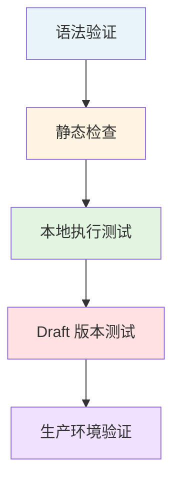

# Terraform 模块测试指南

本指南介绍如何测试 AppMarket Terraform 模块，包括本地验证、集成测试、自动化测试等。

---

## 目录

- [1. 测试概述](#1-测试概述)
- [2. 本地验证](#2-本地验证)
- [3. 集成测试](#3-集成测试)
- [4. 自动化测试](#4-自动化测试)
- [5. Draft 版本测试](#5-draft-版本测试)
- [6. 常见问题排查](#6-常见问题排查)
- [7. 测试清单](#7-测试清单)

---

## 1. 测试概述

### 1.1 测试层次



| 测试阶段 | 目标 | 工具/方法 |
|---------|------|----------|
| **语法验证** | 确保 HCL 语法正确 | `terraform validate` |
| **静态检查** | 检查最佳实践和潜在问题 | `terraform fmt`, `tflint` |
| **本地执行** | 验证 plan 阶段资源配置正确 | `terraform plan` |
| **Draft 测试** | 在 AppMarket Draft 版本创建真实实例 | AppMarket API |
| **生产验证** | 发布后用户真实环境测试 | 用户反馈 |

### 1.2 测试环境准备

**必需工具**：

```bash
# Terraform
wget https://releases.hashicorp.com/terraform/1.6.0/terraform_1.6.0_linux_amd64.zip
unzip terraform_1.6.0_linux_amd64.zip
sudo mv terraform /usr/local/bin/

# TFLint（可选，用于静态检查）
curl -s https://raw.githubusercontent.com/terraform-linters/tflint/master/install_linux.sh | bash

# 验证安装
terraform version
tflint --version
```

**环境变量配置**：

```bash
# 七牛云认证
export QINIU_ACCESS_KEY="your-access-key"
export QINIU_SECRET_KEY="your-secret-key"

# API 端点（可选）
export QINIU_API_ENDPOINT="https://ecs.qiniuapi.com"
```

---

## 2. 本地验证

### 2.1 格式化检查

确保代码格式符合 Terraform 标准：

```bash
cd /path/to/terraform-module

# 检查格式（只显示需要格式化的文件）
terraform fmt -check -recursive

# 自动格式化
terraform fmt -recursive
```

**预期输出**：
- 无输出表示格式正确
- 有输出则列出需要格式化的文件

### 2.2 语法验证

验证 Terraform 配置语法：

```bash
# 初始化（下载 provider）
terraform init

# 语法验证
terraform validate
```

> **注意**：本地 `terraform init` / `terraform apply` 依赖的 provider 安装方式、可用版本以及资源栈白名单，以 `qiniu/terraform-module` 仓库 README 为准；若本地验证失败，先检查 provider 版本、网络和该 README 中的白名单说明，再排查模块本身。

**预期输出**：
```
Success! The configuration is valid.
```

**常见错误**：
```
Error: Unsupported argument

  on main.tf line 10, in resource "qiniu_compute_instance" "example":
  10:   invalid_argument = "value"

An argument named "invalid_argument" is not expected here.
```

### 2.3 静态分析（可选）

使用 TFLint 检查最佳实践：

```bash
# 初始化 TFLint
tflint --init

# 执行检查
tflint
```

**检查项**：
- 未使用的变量和输出
- 硬编码的敏感信息
- 资源命名规范
- Provider 版本约束

### 2.4 生成执行计划

验证资源配置逻辑：

```bash
# 创建测试变量文件
cat > test.tfvars <<EOF
instance_name     = "test-mysql"
instance_type     = "ecs.c1.c2m4"
system_disk_size  = 50
mysql_username    = "admin"
mysql_password    = "<YourPassword>"
mysql_db_name     = "testdb"
EOF

# 生成执行计划
terraform plan -var-file=test.tfvars

# 保存计划到文件（可选）
terraform plan -var-file=test.tfvars -out=tfplan
terraform show tfplan
```

**关键检查点**：

- [ ] 资源类型正确（`qiniu_compute_instance` 等）
- [ ] 资源依赖关系正确（`depends_on`）
- [ ] 变量替换正确（`${var.instance_name}`）
- [ ] 初始化脚本已内联到 `user_data` heredoc 中（moduleContent 模式不能用 `templatefile`）
- [ ] 敏感信息标记为 `sensitive = true`

---

## 3. 集成测试

### 3.1 创建测试实例

**方式 1：直接使用 Terraform**

```bash
# 1. 配置 Provider
cat > provider.tf <<EOF
terraform {
  required_providers {
    qiniu = {
      source  = "qiniu/qiniu"
      version = "~> 1.0"
    }
  }
}

provider "qiniu" {
  access_key = var.qiniu_access_key
  secret_key = var.qiniu_secret_key
  region     = "ap-northeast-1"
}
EOF

# 2. 配置变量（包含认证信息）
cat > terraform.tfvars <<EOF
qiniu_access_key  = "your-access-key"
qiniu_secret_key  = "your-secret-key"
instance_name     = "test-mysql-$(date +%s)"
instance_type     = "ecs.c1.c2m4"
system_disk_size  = 50
mysql_username    = "admin"
mysql_password    = "<YourPassword>"
mysql_db_name     = "testdb"
EOF

# 3. 执行部署
terraform init
terraform apply -auto-approve

# 4. 查看输出
terraform output

# 5. 测试完成后销毁资源
terraform destroy -auto-approve
```

**方式 2：使用测试脚本**（推荐）

```bash
# 使用插件提供的测试脚本
scripts/test-module.sh path/to/terraform-module

# 或指定测试变量（注意：路径必须是绝对路径）
scripts/test-module.sh path/to/terraform-module /absolute/path/to/test.tfvars
```

> **tfvars 路径必须使用绝对路径**：`test-module.sh` 内部会 `cd` 进模块目录后再调用 `terraform`，导致相对路径失效。使用 `$(pwd)/test.tfvars` 或 `$(realpath test.tfvars)` 转换为绝对路径。

### 3.2 验证实例功能

**连接测试**：

```bash
# 获取实例 IP（从 terraform output）
INSTANCE_IP=$(terraform output -raw mysql_endpoint | cut -d: -f1)

# 测试 MySQL 连接
mysql -h $INSTANCE_IP -u admin -p'<YourPassword>' -e "SHOW DATABASES;"

# 预期输出：
# +--------------------+
# | Database           |
# +--------------------+
# | information_schema |
# | mysql              |
# | performance_schema |
# | sys                |
# | testdb             |
# +--------------------+
```

**健康检查**：

```bash
# MySQL 健康检查
mysqladmin ping -h $INSTANCE_IP -u admin -p'<YourPassword>'
# 预期输出：mysqld is alive

# 检查数据库服务状态
ssh -i key.pem ubuntu@$INSTANCE_IP "systemctl status mysql"
```

### 3.3 测试输出参数

验证所有 output 是否正确：

```bash
# 列出所有输出
terraform output

# 验证关键输出
terraform output mysql_endpoint     # 应返回 <IP>:3306
terraform output mysql_username     # 应返回 admin
terraform output instance_id        # 应返回实例 ID
```

---

## 4. 自动化测试

### 4.1 测试脚本结构

创建 `test/` 目录组织测试：

```
terraform-mysql/
├── main.tf
├── variables.tf
├── outputs.tf
├── versions.tf
└── test/
    ├── test.sh              # 主测试脚本
    ├── fixtures/            # 测试数据
    │   ├── basic.tfvars
    │   ├── advanced.tfvars
    │   └── minimal.tfvars
    └── scripts/
        ├── validate.sh      # 验证脚本
        └── cleanup.sh       # 清理脚本
```

### 4.2 测试脚本示例

**test/test.sh**：

```bash
#!/bin/bash
set -e

MODULE_DIR="$(cd "$(dirname "$0")/.." && pwd)"
FIXTURES_DIR="$MODULE_DIR/test/fixtures"

log() {
    echo "[$(date +'%Y-%m-%d %H:%M:%S')] $*"
}

test_scenario() {
    local scenario=$1
    local tfvars=$2

    log "Testing scenario: $scenario"

    cd "$MODULE_DIR"

    # 初始化
    terraform init -upgrade > /dev/null 2>&1

    # 验证语法
    log "  - Validating syntax..."
    terraform validate

    # 格式检查
    log "  - Checking format..."
    terraform fmt -check -recursive

    # 生成计划
    log "  - Generating plan..."
    terraform plan -var-file="$tfvars" -out=tfplan > /dev/null

    # 可选：应用测试（需要真实凭证）
    if [ "$RUN_INTEGRATION_TEST" = "true" ]; then
        log "  - Applying configuration..."
        terraform apply -auto-approve tfplan

        log "  - Verifying outputs..."
        terraform output

        log "  - Cleaning up..."
        terraform destroy -auto-approve -var-file="$tfvars"
    fi

    log "  ✓ Scenario '$scenario' passed"
}

# 运行测试场景
test_scenario "basic" "$FIXTURES_DIR/basic.tfvars"
test_scenario "advanced" "$FIXTURES_DIR/advanced.tfvars"
test_scenario "minimal" "$FIXTURES_DIR/minimal.tfvars"

log "All tests passed!"
```

### 4.3 CI/CD 集成

**GitHub Actions 示例**（`.github/workflows/test.yml`）：

```yaml
name: Terraform Module Test

on:
  pull_request:
    branches: [main]
  push:
    branches: [main]

jobs:
  test:
    runs-on: ubuntu-latest
    steps:
      - name: Checkout
        uses: actions/checkout@v3

      - name: Setup Terraform
        uses: hashicorp/setup-terraform@v2
        with:
          terraform_version: 1.6.0

      - name: Terraform Format Check
        run: terraform fmt -check -recursive

      - name: Terraform Init
        run: terraform init

      - name: Terraform Validate
        run: terraform validate

      - name: Terraform Plan
        run: terraform plan -var-file=test/fixtures/basic.tfvars

      # 可选：集成测试（需要配置 secrets）
      - name: Integration Test
        if: github.event_name == 'push'
        env:
          QINIU_ACCESS_KEY: ${{ secrets.QINIU_ACCESS_KEY }}
          QINIU_SECRET_KEY: ${{ secrets.QINIU_SECRET_KEY }}
        run: |
          export RUN_INTEGRATION_TEST=true
          bash test/test.sh
```

---

## 5. Draft 版本测试

### 5.1 创建 Draft 版本

```bash
# 1. 打包模块为 moduleContent
MODULE_CONTENT=$(scripts/bundle-module.sh path/to/terraform-module)

# 2. 生成 InputSchema
INPUT_SCHEMA=$(scripts/tf-to-schema.sh path/to/terraform-module/variables.tf)

# 3. 创建 Draft 版本
curl -X POST "https://ecs.qiniuapi.com/v1/apps/$APP_ID/versions/" \
  -H "Authorization: Qiniu $ACCESS_KEY:$SIGNATURE" \
  -H "Content-Type: application/json" \
  -d @- <<EOF
{
  "version": "1.0.0-draft",
  "description": "Draft version for testing",
  "deployMeta": {
    "inputSchema": $INPUT_SCHEMA,
    "terraformModule": {
      "moduleContent": "$MODULE_CONTENT"
    },
    "inputPresets": [...]
  }
}
EOF
```

### 5.2 创建测试实例

**使用 `/test-version` 命令**（推荐）：

```bash
# 在 Claude Code 中执行
/test-version app-xxxxxxxxxxxx 1.0.0-draft
```

**或使用 API**：

> **注意**：实例 API 必须使用 region 前缀域名 `{regionID}-ecs.qiniuapi.com`。

```bash
# 创建测试实例（注意域名前缀）
curl -X POST "https://ap-northeast-1-ecs.qiniuapi.com/v1/app-instances/" \
  -H "Authorization: Qiniu $ACCESS_KEY:$SIGNATURE" \
  -H "Content-Type: application/json" \
  -d @- <<EOF
{
  "appID": "app-xxxxxxxxxxxx",
  "appVersion": "1.0.0-draft",
  "inputPresetName": "starter",
  "clientToken": "$(uuidgen)",
  "inputs": {
    "mysql_password": "<YourPassword>"
  }
}
EOF
```

> **inputs 说明**：使用 `inputPresetName` 时，`inputs` 中只需传 preset 未覆盖的 required 字段（通常是 `writeOnly`/`sensitive` 字段如密码、API Key）。传入 preset 已覆盖的字段会导致冲突。

### 5.3 监控部署状态

```bash
INSTANCE_ID="<返回的 appInstanceID>"
REGION="ap-northeast-1"

# 轮询实例状态（注意使用 region 前缀域名）
while true; do
  STATUS=$(curl -s "https://${REGION}-ecs.qiniuapi.com/v1/app-instances/$INSTANCE_ID" \
    -H "Authorization: Qiniu $ACCESS_KEY:$SIGNATURE" | jq -r '.status')

  echo "Instance status: $STATUS"

  case $STATUS in
    "Running"|"Deployed")
      echo "✓ Instance deployed successfully (status: $STATUS)"
      echo "  Deployed = 基础设施已就绪，可读取 outputs 验证应用"
      echo "  Running  = 健康检查通过（部分平台状态流未必到达 Running）"
      break
      ;;
    "Failed"|"DeployFailed")
      echo "✗ Instance deployment failed"
      exit 1
      ;;
    *)
      sleep 10
      ;;
  esac
done
```

### 5.4 获取实例输出

```bash
# 获取实例详情（包含 outputs，使用 region 前缀域名）
curl -s "https://${REGION}-ecs.qiniuapi.com/v1/app-instances/$INSTANCE_ID" \
  -H "Authorization: Qiniu $ACCESS_KEY:$SIGNATURE" | jq '.outputs'

# 预期输出示例：
# {
#   "mysql_endpoint": "10.0.1.100:3306",
#   "mysql_username": "admin",
#   "instance_id": "i-xxxxxxxxxxxx",
#   "instance_ip": "10.0.1.100"
# }
```

### 5.5 删除测试实例

```bash
# 删除实例（使用 region 前缀域名）
curl -X DELETE "https://${REGION}-ecs.qiniuapi.com/v1/app-instances/$INSTANCE_ID" \
  -H "Authorization: Qiniu $ACCESS_KEY:$SIGNATURE"

# 验证删除
curl -s "https://${REGION}-ecs.qiniuapi.com/v1/app-instances/$INSTANCE_ID" \
  -H "Authorization: Qiniu $ACCESS_KEY:$SIGNATURE" | jq '.status'
# 预期：Terminating -> Terminated
```

---

## 6. 常见问题排查

### 6.1 语法错误

**错误信息**：
```
Error: Unsupported block type

  on main.tf line 10:
  10: variabls "instance_name" {

Blocks of type "variabls" are not expected here. Did you mean "variable"?
```

**解决方法**：修正拼写错误 `variabls` → `variable`

### 6.2 变量未定义

**错误信息**：
```
Error: Reference to undeclared input variable

  on main.tf line 20:
  20:   name = var.instace_name

An input variable with the name "instace_name" has not been declared.
```

**解决方法**：检查变量名拼写，确保在 `variables.tf` 中已定义

### 6.3 Provider 初始化失败

**错误信息**：
```
Error: Failed to query available provider packages

Could not retrieve the list of available versions for provider hashicorp/qiniu
```

**解决方法**：
```bash
# 清理缓存
rm -rf .terraform .terraform.lock.hcl

# 重新初始化
terraform init -upgrade
```

> **本地环境额外步骤**：`hashicorp/qiniu` 无法从公网 registry 下载，需先配置 filesystem mirror（见 [Terraform 模块规范 → versions.tf 本地测试](terraform-module.md)），再运行 `terraform init`。

### 6.4 部署失败排查

**步骤**：

1. **查看实例日志**：
   ```bash
   curl -s "https://ecs.qiniuapi.com/v1/app-instances/$INSTANCE_ID/logs" \
     -H "Authorization: Qiniu $ACCESS_KEY:$SIGNATURE"
   ```

2. **检查 Terraform State**：
   ```bash
   # 通过 RFS API 查询 Stack 状态
   curl -s "https://ecs.qiniuapi.com/v1/stacks/$STACK_ID" \
     -H "Authorization: Qiniu $ACCESS_KEY:$SIGNATURE"
   ```

3. **常见部署失败原因**：
   - 镜像不存在或无权限访问
   - 实例规格在指定区域不可用
   - 配额不足（CPU、内存、磁盘）
   - user_data 脚本执行失败

---

## 7. 测试清单

### 7.1 本地测试清单

**基础验证**：
- [ ] 代码格式化 (`terraform fmt -check`)
- [ ] 语法验证 (`terraform validate`)
- [ ] 静态检查 (`tflint`)
- [ ] 执行计划生成 (`terraform plan`)

**配置检查**：
- [ ] 所有变量在 `variables.tf` 中定义
- [ ] 所有变量有合理的默认值或 description
- [ ] 敏感变量标记 `sensitive = true`
- [ ] 所有输出在 `outputs.tf` 中定义
- [ ] 输出描述清晰
- [ ] Provider 版本约束明确

**资源检查**：
- [ ] 资源命名规范（使用变量）
- [ ] 资源依赖关系正确
- [ ] 初始化脚本已内联到 user_data heredoc（moduleContent 模式）
- [ ] user_data 脚本语法正确

### 7.2 集成测试清单

**Draft 版本测试**：
- [ ] DeployMeta 生成成功
- [ ] Draft 版本创建成功
- [ ] 测试实例创建成功
- [ ] 实例状态变为 `Deployed` 或 `Running`（`Deployed` = 基础设施已就绪，`Running` = 健康检查通过）
- [ ] 所有输出正确返回（public_ip、access_url 等）

**功能验证**：
- [ ] 应用服务正常启动
- [ ] 端口监听正常
- [ ] 健康检查通过
- [ ] 初始化脚本执行成功
- [ ] 配置文件正确生效

**清理验证**：
- [ ] 测试实例成功删除
- [ ] 相关资源全部释放

### 7.3 发布前检查

- [ ] 所有本地测试通过
- [ ] 所有集成测试通过
- [ ] 文档完整（README、变量说明、输出说明）
- [ ] 示例配置文件提供
- [ ] 版本号符合语义化规范
- [ ] 变更日志更新

---

## 相关资源

- [Terraform Testing Best Practices](https://www.terraform.io/docs/language/modules/testing-experiment.html)
- [TFLint 规则文档](https://github.com/terraform-linters/tflint/tree/master/docs/rules)
- [AppMarket API 文档](../README.md#api-端点)
- [测试脚本](../scripts/test-module.sh)
- [测试版本命令](../commands/test-version.md)
